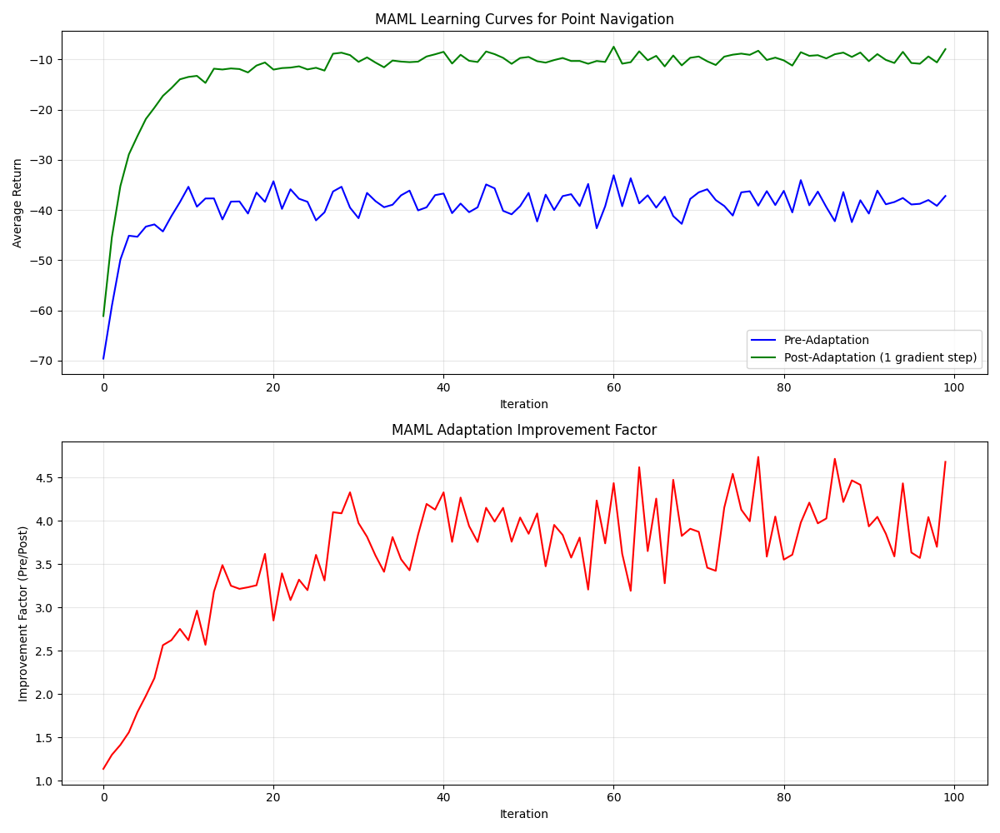

# Model-Agnostic Meta-Learning (MAML) - Minimal Reproduction

This repository contains a minimal working implementation of MAML from [Finn et al., ICML 2017](https://arxiv.org/abs/1703.03400). It validates the methodology proposed in the paper by reproducing one of the RL experiments.


## Point Navigation Experiment Results

When run, the code produces results showing how MAML enables fast adaptation. After training, the agent can adapt to new navigation tasks with just one gradient step.



To visualize results:
```bash
python plot_maml_results.py
```

## Setup (Ubuntu 22.04)

### Using Conda Environment File
```bash
# Create and activate environment
conda env create -f environment.yml
conda activate maml_rl_fixed
```

### Manual Setup
```bash
# Create environment
conda create -n maml_rl python=3.5
conda activate maml_rl

# Install dependencies
pip install tensorflow==1.4.0
pip install numpy scipy matplotlib gym mujoco-py
pip install joblib==0.9.4 python-dateutil pandas path.py mako flask h5py scikit-learn
```

## Running the Experiment
```bash
# Run the point navigation experiment
cd maml_examples
python maml_trpo_point.py

# Visualize results
cd ..
python plot_maml_results.py
```

## Notes
- TensorFlow 1.4.0 is required for compatibility
- Python 3.5 is required
- Training takes ~10-20 minutes depending on hardware

## Implementation Details

The core MAML implementation includes:
- `sandbox/rocky/tf/algos/maml_trpo.py`: MAML with TRPO
- `maml_examples/point_env_randgoal.py`: 2D point environment
- `maml_examples/maml_trpo_point.py`: Training script
- `plot_maml_results.py`: Visualization script
